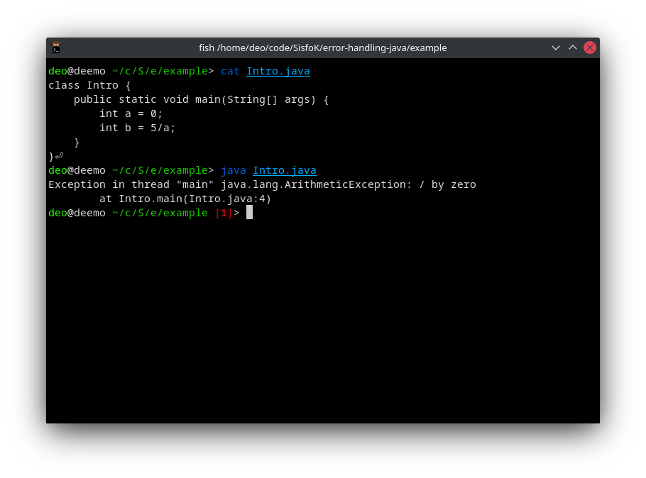

# Java Exception Handling

Exception handling adalah mekanisme untuk menangani exception ketika program
dijalankan.

Exception sendiri adalah sebuah kondisi dijalankan, program tersebut berhenti
secara tiba-tiba dan abnormal. Alasannya ada banyak jenis, misalnya karena
programnya error, kesalahan hardware, file tidak ditemukan, kesalahan
perhitungan, dsb.

Misalnya:

```java
class Intro {
    public static void main(String[] args) {
        int a = 0;
        int b = 5/a;
    }
}
```

Akan menghasilkan error seperti berikut:



Hal ini karena pembagian dengan angka 0.

## Java Exception

Java exception adalah objek yang menjelaskan jenis exception yang terjadi dalam
suatu program. Ketika terjadi suatu kejadian abnormal, exception tersebut
dilempar (_thrown_). Kode yang bertanggung jawab untuk menanggapi anomali ini
disebut exception handler.

### Bagaimana menghandle exception

- Try : digunakan sebagai percobaan kode yang abnormal
- Catch: berfungsi sebagai exception handler.
- Finally: digunakan untuk eksekusi default
- Throw: untuk throws sebuah exception yang explicit.
- Throws: memuat kemungkinan exception.

## Beberapa jenis exception

1. Checked Exception, exception yang sudah bisa terprediksi oleh JVM pada saat
2. compile time, contohnya file tidak ditemukan, SQLException, dsb-nya.
3. Unchecked Exception, exception yang ditemukan pada saat runtime. Merupakan
4. class yand di extends dari class RuntimeException. Contohnya:
   ArithmeticException, NullPointerException, Array Index out of Bound
   exception.
5. Error, terjadi ketika ada kesalahan logika, misalnya stack overflow.

